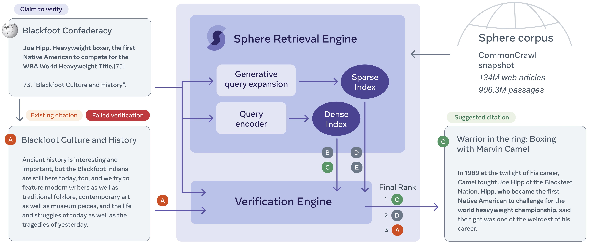

# Side - The AI Knowledge Editor

For now, let's write this README as a tutorial for Jade to reproduce our results. At that point, we will be at a great point to clean and publish it.

## Goal

Run the **side** pipeline on novel and recent Wikipedia articles.

## Data Preprocessing

The official WAFER data lives in `/checkpoint/fabiopetroni/WAI/DATA`.

The data to run inference for lives in `/checkpoint/fabiopetroni/WAI/time_split_data/train_cit_ALL_20210701.jsonl`.

There are two preprocessing steps that needs to be done before being able to execute the pipeline:

1. **detect sentence boundaries**. We need a *sentences* list in the *meta* field of each json record, containing all the sentences before the [CIT] tag (i.e., *sentences[-1]* is the claim that we need to verify). Samuel should have a script to do this somewhere. We should add that script in `side/scripts`. You can use the official WAFER data for reference.

2. **chunk url_text**. We need to chunk the full text of a url in chunks of 100 tokens, and add replace the *provenace* entry (for now a single element) with an ordered list of chunks. Again Samuel has a script to do this, that should live in `side/scripts`. Again, you can use the official WAFER data for reference.

3. **filter out non english content**. Again, Samuel should have a script.

## Retrieval Engine

### Sparse - GAR
We want to query a BM25 index with an extended query, where the sentence containing the [CIT] tag (i.e., the last entry in the *sentences* list) is concatenated with a url title predicted with a seq2seq model (i.e., GAR).

1. To create the extended query, run the script in `side/retrieval_engine/GAR_urltitle_generator.py`. This will create a file where in the *input* field of every record there is the extended query for BM25.

2. Query BM25 with the script in https://github.com/fairinternal/kilt_internal and store the predictions.

### Dense - DPR
Samuel to push the code and write few lines.

## Verification Engine
Samuel to push the code and write few lines.

