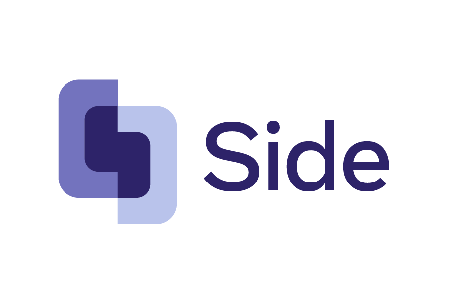

--------------------------------------------------------------------------------

Welcome! This is an effort to improve citations on Wikipedia.
To read more about the overarching goals of this effort, please see our article on [ML-Assisted Wikipedia Editing](https://meta.wikimedia.org/wiki/Research:Machine_Learning_Assisted_Wikipedia_Editing).

The Side system is described in the following paper:

```bibtex
@inproceedings{petroni-etal-2022-improving,
    title = "Improving Wikipedia Verifiability with AI",
    author = {Petroni, Fabio  and Broscheit, Samuel and Piktus, Aleksandra and Lewis, Patrick and Izacard, Gautier and Hosseini, Lucas and Dwivedi-Yu, Jane and Lomeli, Maria and Schick, Timo and Mazaré, Pierre-Emmanuel and Joulin, Armand and Grave, Edouard  e Riedel, Sebastian},
    url = "https://openreview.net/forum?id=qfTqRtkDbWZ",
    year = "2022"
}
```

[https://openreview.net/forum?id=qfTqRtkDbWZ](https://openreview.net/forum?id=qfTqRtkDbWZ)

Read our blog post [https://tech.fb.com/artificial-intelligence/2022/07/how-ai-could-help-make-wikipedia-entries-more-accurate/](https://tech.fb.com/artificial-intelligence/2022/07/how-ai-could-help-make-wikipedia-entries-more-accurate/).

**Check out the Side demo at [https://verifier.sideeditor.com](https://verifier.sideeditor.com)!**

Code and models in [projects/verify_wikipedia](projects/verify_wikipedia).

## License
Side is MIT licensed. See the [LICENSE](LICENSE) file for details.
