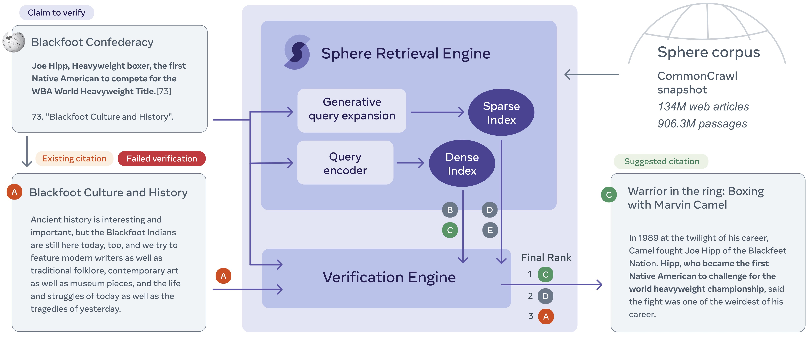

# Quick start

This is a quick start tutorial to run inference on pre-trained models. 

## Setup

Install the project with

**NOTE: The `side` conda environment is essential for some slurm scripts!**

```bash
conda create -n side -y python=3.8 && conda activate side
cd projects
#git submodule add git@github.com:facebookresearch/distributed-faiss.git
cd distributed-faiss
pip install -e .
cd ..
#git submodule add git@github.com:facebookresearch/KILT.git
cd KILT
pip install -e .
cd ..
cd verify_wikipedia
pip install -r requirements.txt
pip install -e git+https://github.com/fairinternal/fairseq-py#egg=fairseq
pip install hydra-core==1.1.1
```

## Download WAFER data

Follow [this README](../../datasets/WAFER.md).


## Architecture


## Downloading Index and Models

Create a `models` folder under `verify_wikipedia` containing the following three archives uncompressed:

- [dense](https://dl.fbaipublicfiles.com/side/dense.tar.gz) [1.2 TB]
- [sparse](https://dl.fbaipublicfiles.com/side/sparse.tar.gz) [780 GB]
- [verifier](https://dl.fbaipublicfiles.com/side/verifier.tar.gz) [8 GB]


## Retrieval Engine

### Dense Retrieval

#### Setting the discovery-config path

For communicating with the distributed server, a "discovery-config" file containing information about the nodes and ports used by the distributed server is required. That file needs to be updated each time the server is started,
potentially causing a ``PermissionError`` if you use the script as is. To fix this, you need to:

1. Replace the default ``retriever.rpc_retriever_cfg_file`` in ``best_dpr_remote.yaml`` with some file that you have
   write access to.
2. Replace the default ``--discovery-config`` in ``start_distributed_faiss.sh`` with the very same file.

#### Running retrieval with DPR

1. First start the distributed server (16 nodes) in a seperate screen/tmux session (interupting the job does not cancel the job,
   this has to be done manually with scancel) with distributed_faiss:

```bash
screen -S distributed_faiss
conda activate side
bash internal/eval/retrieval/retrieve/start_distributed_faiss.sh models/dense/index/
```

Tips: `Ctrl + a d` to detach for the screen session; `screen -r distributed_faiss` to reconnect.

2. As soon as the distributed server runs (16 nodes are shown in squeue), then retrieval for *evaluation data* can be
   done locally (on a devfair machine) with `retrieve.sh` but some devfairs might not have free ressources. So the
   safest way is to do the inference with the sharded mode which is also faster:

```bash
bash internal/eval/retrieval/retrieve/retrieve_gpu_sharded.sh internal/eval/retrieval/retrieve/configs/best_dpr_remote.yaml
```

Alernatively it can be executed locally (for debug purposes) with:

```bash
bash internal/eval/retrieval/retrieve/retrieve.sh internal/eval/retrieval/retrieve/configs/best_dpr_remote.yaml
```

If you want to use a custom dataset (let's say `custom_test`), you should add a configuration for it in [conf/datasets/evaluation.yaml](conf/datasets/evaluation.yaml), and then specify the new `evaluation_dataset` in the command line (or in the configuration script):
```bash
bash internal/eval/retrieval/retrieve/retrieve.sh internal/eval/retrieval/retrieve/configs/best_dpr_remote.yaml evaluation_datasets=[custom_test]
```

#### Evaluate dense retrieval

```bash
python ../KILT/kilt/eval_retrieval.py outputs/predictions/evaluation.retrievers.dpr_remote.DPR/<id>/wafer-dev.jsonl ../../data/wafer-dev.jsonl --rank_keys url --ks 1,100
```

### Sparse Retrieval

#### Running retrieval with GAR

1. First augment each query with generated expansions. Note, for this to work you should have the ["meta"]["sentences"] field populated as described in [this README](../../datasets/WAFER.md).

```bash
mkdir -p outputs/predictions/expanded_inputs/
python scripts/GAR_urltitle_generator.py --test_filename ../../data/wafer-dev.jsonl --out_filename outputs/predictions/expanded_inputs/wafer-dev.jsonl
```

2. Run BM25 retrieval with expanded queries with the KILT library. You should modify (conf/kilt/wafer.json)[conf/kilt/wafer.json] to point on the desired prediction file.

```bash
module unload java
export JAVA_HOME=/private/home/fabiopetroni/jdk-11.0.9
PATH=${PATH}:${JAVA_HOME}/bin
mkdir -p outputs/predictions/GAR/
python ../KILT/scripts/execute_retrieval.py --test_config conf/kilt/wafer.json --model_name bm25 --model_configuration conf/kilt/bm25_ccnet.json --output_folder outputs/predictions/GAR/
```

#### Evaluate sparse retrieval

```bash
python ../KILT/kilt/eval_retrieval.py outputs/predictions/GAR/wafer-dev.jsonl ../../data/wafer-dev.jsonl --rank_keys url --ks 1,100
```

## Verification Engine

First edit the `internal/eval/retrieval/retrieve/configs/best_reranker.yaml` to point to the dense (i.e., dpr) and sparse (i.e., gar) prediction files. 

Running the verification engine can be quite slow and it's better done sharded. To do so, call for example 

```bash
bash internal/eval/retrieval/retrieve/retrieve_gpu_sharded.sh internal/eval/retrieval/retrieve/configs/best_reranker.yaml
```

#### Evaluate the verification egine

```bash
python ../KILT/kilt/eval_retrieval.py outputs/predictions/evaluation.retrievers.reranker.Reranker/wafer-dev.jsonl ../../data/wafer-dev.jsonl --rank_keys url --ks 1,100
```
